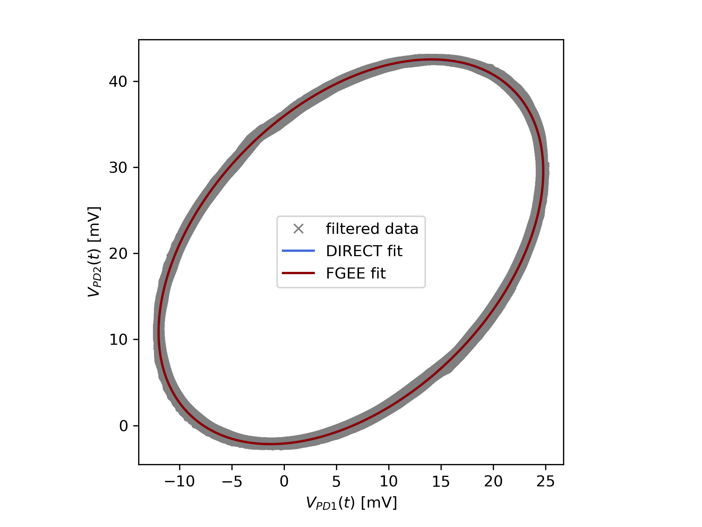

# Polarimetric Fibre Optic Current Sensor Analysis

## Introduction

Analysis code for a polarimetric fibre optic current sensor (FOCS) developed while conducting a UROP at the Imperial Plasma Physics research group. The exact set-up of the sensor being analysed is shown in Fig. 1.


## Using the Analysis Software

The file ```full_analysis.py``` is an example of how one can combine the packages developed for this type of FOCS to process the data. It is designed as a file that will run with no further modification, though at its core it is only designed to process data from one specific oscilloscope format - though this is likely not a difficult modification to make. Ensure all requirements in ```requirements.txt``` are met.

Included in the repository is the file ```data/large_proportion_of_ellipse.csv``` which is the default data set analysed in ```full_analysis.py```. This data set corresonds to raw data collected from a trial run of the FOCS and includes data collected from a reference Pearson coil so that one can compare the results of the analysis to a calibrated current measurement.

If one runs that analysis software one should expect three output plots, firstly a fitted elliptical Lissajous figure with two different methods:



Secondly, a plot of the remapped dataset:


And finally the output current along with a comparison to a Pearson coil - a callibrated current sensor:


## Methods

The data analysis scheme can be briefly summarised by the following flow chart:


## References

The "fast guaranteed ellipse algorithm" used in the fitting of the ellipse was developped by Z.Szpak, W. Chojnacki and A. van den Hengel and more details of their work can be found in *“Guaranteed ellipse fitting with a confidence region and an uncertainty measure for centre, axes, and orientation,” Journal of mathematical imaging and vision, vol. 52, no. 2, pp. 173–199, Jun 01, 2015. [Online]. Available: https://link.springer.com/article/10.1007/s10851-014-0536-x*. The original MATLAB implementation of their algorithm by Z.Szpak was rewritten and implemented in Python here.
